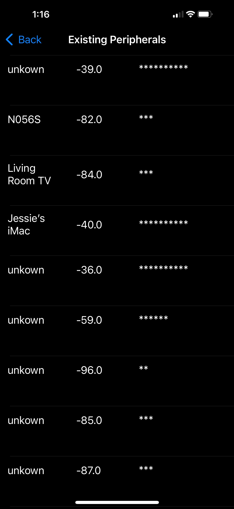
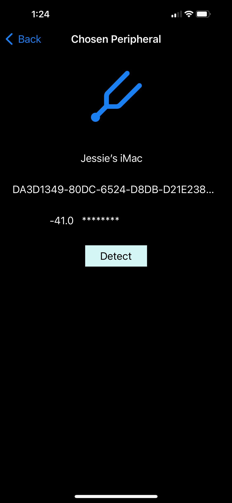

# Signal Strength

## iOS App 

### This app uses bluetooth low energy to detect the other bluetooth devices, such as the other iphones.  It displays the RSSI values.  The app also shows the relative strength of the RSSI values.  Users can keep detecting the devices by clicking the detect button.

&nbsp;

&nbsp;

 Detected devices 

&nbsp;

&nbsp;

 Device's details 

&nbsp;

## Programming Style

1. I use Core Bluetooth libary to set the device to be a client, a central in Bluetooth's aspect.  

2. I override central manager callback methods to scan and discover devices nearby.  I also read and display the RSSI (Received Signal Strength Indication) of the devices.   

&nbsp;

## All rights reserved.